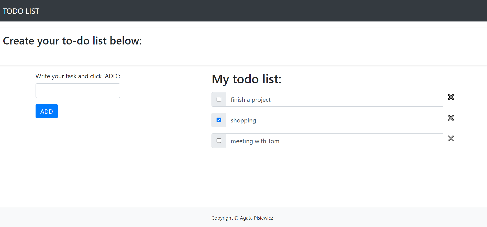
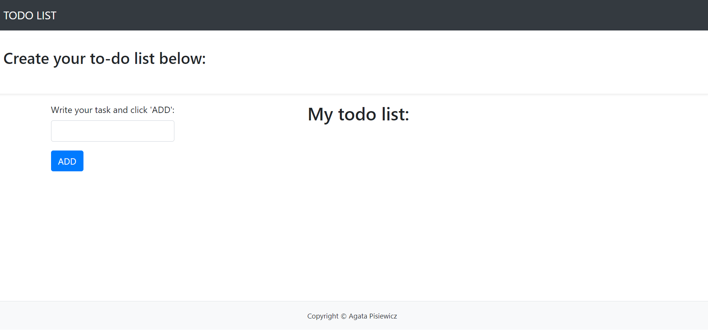

## Flask To-Do List Application
[Link to the App](web-production-c1a9.up.railway.app)

#### This is a simple to-do list web application built using Flask. It allows users to add, update, and delete tasks. The tasks are stored in the session, which means they persist during the session lifetime but are not saved permanently.

### Features:
- Add Tasks: Users can add new tasks using a simple form.
- Mark Tasks as Complete: Tasks can be checked or unchecked to indicate completion.
- Delete Tasks: Users can remove tasks from the list.
- Session Management: Tasks are stored in the session, with a session duration of one day.

### Screenshots

